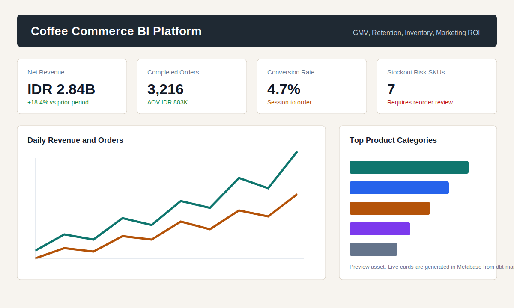

# Coffee Commerce BI Platform

End-to-end Business Intelligence demo platform for a coffee-commerce company. The project demonstrates source ingestion, warehouse modeling, dbt transformations, data quality tests, orchestration, dashboard-ready marts, and Docker-based deployment.



## Live Dashboard

Hosted Metabase dashboard: [Coffee Commerce BI Executive Dashboard]([http://194.233.82.4:8080/dashboard/2-coffee-commerce-bi-executive-dashboard](http://194.233.82.4:8080/public/dashboard/00c90e73-c2c0-4828-9220-6bd725d6c000))

## Why This Project Exists

A BI Engineer in a coffee-commerce setting often sits between data engineering and data analysis: build reliable reporting infrastructure, transform raw data into trusted datasets, and help stakeholders monitor KPIs. This project mirrors that workflow with synthetic ecommerce data that is safe to publish.

## Stack

- PostgreSQL as the analytical warehouse.
- dbt for staging, intermediate models, marts, and data tests.
- Prefect for pipeline orchestration.
- Python for deterministic synthetic data generation and raw loading.
- Metabase for BI dashboards.
- Docker Compose for local and VPS deployment.
- GitHub Actions for VPS redeploys on `main`.

## Architecture

```text
Prefect flow: coffee-commerce-bi-refresh
  -> Generate deterministic synthetic source CSVs
  -> Load source-shaped tables into PostgreSQL raw schema
  -> Run dbt build
       raw -> staging views -> intermediate tables -> mart tables
  -> Metabase dashboard queries the mart tables
```

## Warehouse Layers

- `raw`: source-shaped ecommerce, inventory, marketing, and web event tables.
- `staging`: typed and cleaned dbt views.
- `intermediate`: enriched order lines, order revenue, and customer order sequence.
- `marts`: business-facing models for executive reporting and operational monitoring.

Key marts:

- `marts.fct_daily_kpis`: GMV, net revenue, orders, AOV, conversion rate, margin.
- `marts.mart_product_performance`: category/product revenue, units sold, browsing conversion.
- `marts.mart_customer_cohorts`: monthly retention and repeat purchasing.
- `marts.mart_inventory_risk`: stock availability, reorder status, days of cover.
- `marts.mart_marketing_roi`: spend, revenue, ROAS, CAC by channel.

## Quick Start

1. Create a local environment file:

```bash
cp .env.example .env
```

2. Start the warehouse, Metabase, and reverse proxy:

```bash
docker compose up -d warehouse metabase nginx
```

3. Generate data, load Postgres, and run dbt:

```bash
docker compose --profile pipeline run --rm pipeline
```

4. Create Metabase cards and a starter dashboard. The setup script also attempts to enable Metabase public sharing and prints the generated `/public/dashboard/...` path when that succeeds:

```bash
docker compose --profile setup run --rm metabase-setup
```

5. Open the dashboard surface:

```text
http://localhost
```

Default Metabase demo login is controlled by `.env`:

```text
MB_ADMIN_EMAIL=demo@coffee-bi.local
MB_ADMIN_PASSWORD=change_me_metabase
```

Change those before deploying to a public VPS.

If port `80` is already in use on your machine, set `NGINX_PORT=8080` in `.env`. The hosted demo linked above currently uses port `8080`; for a hardened public deployment, prefer `80`/`443` through Nginx and keep PostgreSQL and Metabase's container port private.

## Data Quality

Synthetic data is generated with weighted customer channels, seasonal order volume, variable basket sizes, discounts, shipping fees, campaign spend, browsing sessions, and inventory positions. The goal is KPI variance that looks plausible in a BI dashboard instead of flat demo numbers.

The dbt project includes tests for:

- Primary keys and uniqueness.
- Foreign-key style relationships between orders, customers, products, and line items.
- Accepted values for statuses, channels, product categories, and inventory risk labels.
- Non-negative counts, revenue, inventory, and marketing metrics, with a guardrail for extreme negative margin values.
- Valid order totals where discounts never exceed gross revenue.

Run tests through the full build:

```bash
docker compose --profile pipeline run --rm pipeline dbt build --project-dir /app/analytics --profiles-dir /app/analytics
```

## Deployment

The project is VPS-ready. Nginx exposes the configured public port and proxies to Metabase inside the Docker network. PostgreSQL, Metabase's container port, and pipeline containers stay private by default.

See [DEPLOYMENT.md](DEPLOYMENT.md) for Ubuntu VPS setup, UFW firewall rules, `.env` handling, and GitHub Actions secrets.

## Orchestration Evidence

The pipeline entry point is a Prefect flow (`coffee-commerce-bi-refresh`) that generates synthetic data, loads raw PostgreSQL tables, and runs `dbt build`. For recruiter-facing evidence, include a terminal or Prefect run screenshot after deployment showing a successful flow run with the dbt build step.

## Portfolio Notes

This project is designed to be listed on a BI Engineer resume as:

```text
Coffee Commerce BI Platform | PostgreSQL, dbt, Prefect, Metabase, Docker, GitHub Actions
Built a Dockerized analytics platform for synthetic coffee-commerce data, modeling raw operational sources into tested dbt marts for GMV, retention, product performance, inventory risk, and marketing ROI. Deployed the demo with Metabase, Nginx, and GitHub Actions redeployment on a VPS.
```
